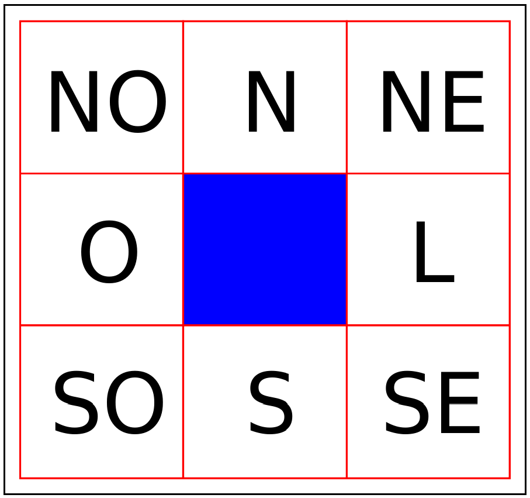

# O "**Hello World**" no Santos Dumont

## Introdução

A execução de um código em um **supercomputador** requer alguns passos antes da compilação e execução. Nesse sentido, este **Git** busca auxiliar nessas etapas. Para isso, vamos utilizar o problema do **Jogo da Vida** (*Game of Life*). É um exemplo simples de implementação e que funciona bem na arquitetura da **GPU**.

## O problema

O **Jogo da Vida** é um **autômato celular** com um conjunto de regras determinísticas. Ele é composto por células que formam uma grade regular de tamanho **m x n**. Cada célula só pode assumir um dos dois estados (**vivo** ou **morto**) e deve obedecer ao seguinte conjunto de regras:

* Uma **célula viva** morre de solidão se tem menos de **dois vizinhos vivos**.
* Uma **célula viva** morre de superpopulação se tem mais de **três vizinhos vivos**.
* Uma **célula morta** torna-se **viva** se tem exatamente **três vizinhos vivos**.
* Uma **célula viva** permanece **viva** se tem **dois ou três vizinhos vivos**.

Assim, a cada passo de tempo discreto, uma determinada célula muda seu estado conforme o conjunto de regras e a **vizinhança de Moore**. A vizinhança adotada é ilustrada pela **Fig. 1**. A célula central é a analisada com oito células vizinhas e a condição de contorno pode ser fixa, com valores de 0 ou 1, pode ser reflexiva ou periódica.

<figure style="text-align: center;">
  
  <figcaption>**Figura 1.** Vizinhança de Moore.</figcaption>
</figure>

## Da submissão

Os arquivos do **Git** devem estar na conta do cluster. Considerando esse cenário, dois arquivos são importantes:

* **`start.sh`**: script para copiar os arquivos para a partição de execução do código.
* **`GOL.srm`**: script de submissão do código. Esse script é chamado de dentro do **`start.sh`**.

É necessário usar o compilador da **NVIDIA** **`nvcc`**. A compilação é semelhante ao **`gcc`**, conforme observado abaixo:

```bash
nvcc gol.cu -o gol.exec

```markdown
### Observações:

1. A linha 16 do código `gol.cu`: `#define BLOCK_SIZE 32` define o **tamanho do bloco**. O limite das **GPUs** da **NVIDIA** é de **1024 threads por bloco**, ou seja, $1024 = 32 \times 32$.
2. A linha 64 do código `gol.cu` possui o **kernel** definido e seu cabeçalho é `__global__ void GPU_Global_K(int *buff1, int *buff0)`. Este é o código que roda efetivamente na **GPU**.
3. Lembre-se: a GPU trabalha com matrizes de forma linearizada.
4. Material de apoio: (https://seer.ufrgs.br/index.php/rita/article/view/RITA-VOL22-NR2-233)
5. O código recebe **3 parâmetros** da linha de comando, que são: **largura** e **altura** da malha e a **quantidade de passos** de tempo. Dado que o código está compilado, sua execução é:

```bash
./gol.exec 2048 1024 1000
            |----|-----|--> 1000 passos de tempo
            |----|--------> Altura de 1024 células
            |-------------> Largura de 2028 células
